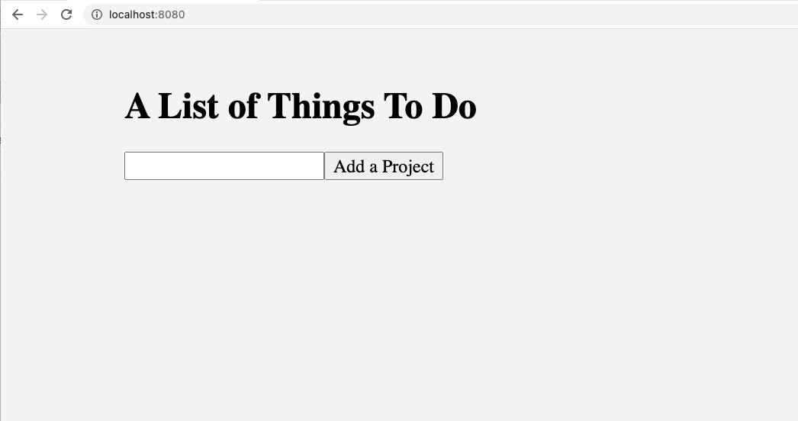

# Installing Packages

You should already have node installed. If you are using nvm, be sure to use:

```
nvm use stable
```

## Mongo

Start Mongo if it is not already started:

### Mac OS

Perhaps you have it running already as a service on MacOS:

```
brew services list
brew services start mongodb-community@4.0
```

### Windows

[See the documentation for Windows](https://docs.mongodb.com/v3.2/tutorial/install-mongodb-on-windows/).

### Linux

To check whether Mongo is running:

```
sudo systemctl status mongodb
```

To stop Mongo:

```
sudo systemctl stop mongodb
```

To start or restart Mongo:

```
sudo systemctl start mongodb
sudo systemctl restart mongodb
```

## Running Node

Let's setup node and install needed packages:

```
cd back-end
npm init
```

This will ask you a number of questions. Here is how I answered them:

```
package name: (node-express-vue-todo)
version: (1.0.0)
description: todo list
entry point: (script.js) server.js
test command:
git repository:
keywords:
author:
license: (ISC)
```
**Be sure to make the entry point server.js**

Next, install some packages:

```
npm install express body-parser mongoose
```

We'll be using Express for the REST API. The body-parser package will help us parse incoming HTTP requests. We'll use Mongoose to provide an object interface for the Mongo database. 

Now run the node server:

```
node server.js
```

This will start on port 3000 to answer API queries.

## Git and Node

**Tip**: when putting code into a repository that uses node.js, be sure to create a file called
  `.gitignore` in the **top level** of your repository that contains:

```
node_modules
```

In this exercise, I have already placed a `.gitignore` into the repo for you.

## Running the front end

You can run the front by doing the following:

```
cd front-end
npm install
npm run serve
```

You should be able to browse to `localhost:8080` and see the front end as it
exists so far:

