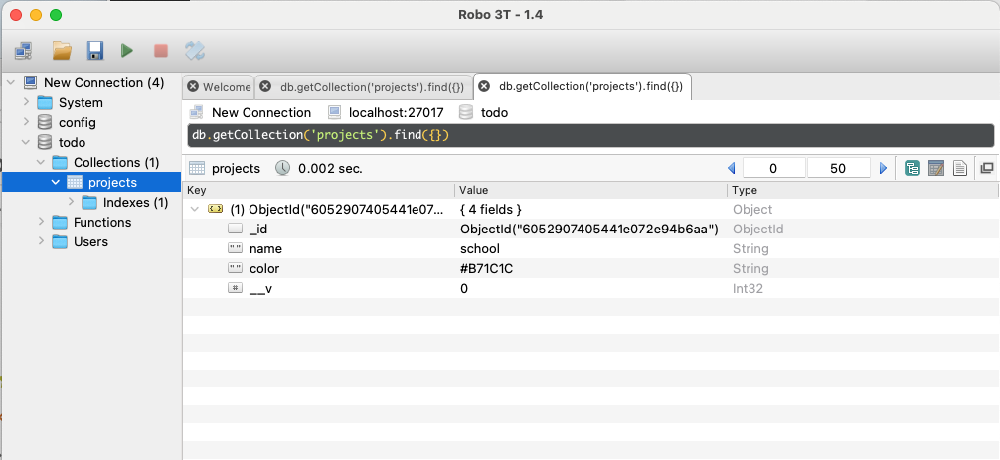
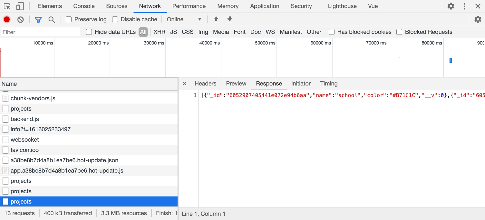

# Projects

We are going to build the back end for the new todo list application. This version will have a separate todo list for each project.

For all our subsequent code, you will be using the `back-end` directory.

## Setup

We'll start with a basic setup for a back end server. In `server.js`, put the following:

```javascript
const express = require('express');
const bodyParser = require('body-parser');
const mongoose = require('mongoose');

const app = express();

// parse application/x-www-form-urlencoded
app.use(bodyParser.urlencoded({
  extended: false
}));

// parse application/json
app.use(bodyParser.json());

// connect to the database
mongoose.connect('mongodb://localhost:27017/todo', {
  useNewUrlParser: true,
  useUnifiedTopology: true
});

app.listen(3000, () => console.log('Server listening on port 3000!'));
```

This is the boilerplate we'll use for a Node, Express, and Mongo back end. We first load
the modules we need. Then we create an Express app and we configure the body
parser library so that it will parse forms and JSON requests. We then connect to the Mongo database, specifyin gthe URL where it is running,`localhost:27017`, and the name of the database we want to create/use, `todo`.

We start the server on port 3000.

## Creating projects

Remember that on the back end a REST API will support CRUD operations -- Create, Read, Update, and Delete. We will start by doing the create and read operations for projects.

Add the following before the `app.listen()` line in `server.js`:

```javascript
// Create a scheme for projects
const projectSchema = new mongoose.Schema({
  name: String,
  color: String
});

// Create a model for projects
const Project = mongoose.model('Project', projectSchema);
```

The schema tells Mongoose what properties to use in each document. Here, we create a scheme for projects that has a name and a color, using a string for both data types.

The model tells Mongoose to create a collection called projects that is mapped to the model named Project.

Now let's do the create operation:

```javascript
// Create a project
app.post('/api/projects', async (req, res) => {
  const project = new Project({
    name: req.body.name,
    color: req.body.color
  });
  try {
    await project.save();
    res.send(project);
  } catch (error) {
    console.log(error);
    res.sendStatus(500);
  }
});
```

This sets up a REST API endpoint at `/api/projects`. A POST to this endpoint will setup `req.body` to contain the project name sent in the POST request from the front end. The fields `name` and `color` inside of the request body must match the data sent with axios in Home.vue.

This function creates a new Project, then calls its save method to save it to the mongo database. It sends the saved item back to the front end in 200 OK response.

If an error occurs, the function sends a 500 error response.

We have to use `await` in the definition of the function that handles this API endpoint because we are using `await` when saving the project to the database. Any time the back end communicates with the database, it has to talk to a separate database server (running on the same machine or a different machine), and this can take some time, so Mongoose returns a Promise from all database operations.

Note, for now, our API has no authentication and *anyone* can create a project. Once we show you how to support authentication, we can create a separate list of projects for each user, and users will only be able to access their own projects.

## Testing project creation

Every time you make changes to the server you need to quit the server with `control-c` and then restart it:

```
node server.js
```

Use the `curl` command to add a project:

```
curl -d '{"name": "school", "color": "#B71C1C"}' -H 'Content-Type: application/json' http://localhost:3000/api/projects
```
You should see the following response:

```
{"_id":"6052907405441e072e94b6aa","name":"school","color":"#B71C1C","__v":0}
```

This shows that an item was created in the database, using the name `school`. Note this item also has a unique `_id` property that is automatically created by Mongo, plus a `__v` property that is used for versioning. Versioning of documents with mongoose is beyond this tutorial, but you can [read about the details of versioning](http://aaronheckmann.blogspot.com/2012/06/mongoose-v3-part-1-versioning.html) if you like.

To verify that our object is in the database, we can use a program like [robomongo](https://robomongo.org/) or [MongoDB Compass](https://www.mongodb.com/products/compass) to visualize your database and see the data that is inserted. Note you can [download just Robo 3T without registering](https://github.com/Studio3T/robomongo/releases) because it is open source.

Here is how Robo 3T shows this item in my database:



## Getting a list of all projects

Next, we'll support the read operation:

```javascript
// Get a list of all projects
app.get('/api/projects', async (req, res) => {
  try {
    let projects = await Project.find();
    res.send(projects);
  } catch (error) {
    console.log(error);
    res.sendStatus(500);
  }
});
```

We use Project.find() to get the list of all of the projects in the projects collection, and then send them back to the browser. Notice that since we use await we need to use async for this method. We also use a try/catch block to catch any errors. If something goes wrong here, we assume it is a major error for our server, so we return a 500 error code.

Restart the server and test it with curl:

```
curl -X GET localhost:3000/api/projects
```

You should get this response:

```
[{"_id":"60528589a3bade0226da101c","name":"school","__v":0}]
```

Notice how the response is a *list* of projects, since there may be more than one, and each project will be within its own JSON object.

## Updating and deleting projects

Our API should probably support updating and deleting objects as well. For simplicity, we will leave this out. We will show you how to implement updating and deleting for the todo list items.

## Testing with the front end

You should also be able to use the front end to add and list projects now. Use the `Network` tab in the browser console to view the network traffic for the API.


