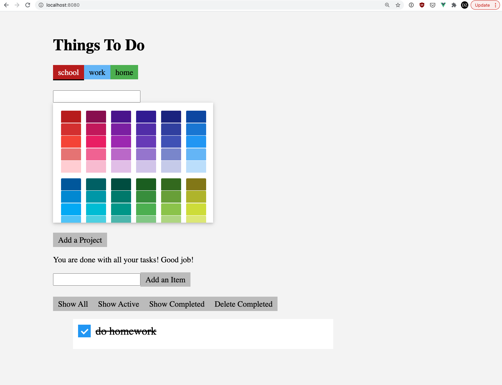

# Todo Items

Now we need to create a separate list of todo items for each project.

## The schema and model

In `server.js`, before the `listen`, create a schema for items:

```javascript
// Schema for items
const itemSchema = new mongoose.Schema({
    project: {
        type: mongoose.Schema.ObjectId,
        ref: 'Project'
    },
    text: String,
    completed: Boolean,
})
```

The important part of this schema is that it referencse a project, so that an item *belongs to* a project. This creates a *one-to-many* relationship between projects and items, such that one project may have many items belonging to it.

**Note**: The items collection will store all of the items for all of the projects, all mixed together. The todo list for a given project is distinguished by the `project` field referencing the identifier of the project it belongs to.

An item also has a `text` field, a string, and a `completed` field, a boolean.

Right after the schema, create a model for items:

```javascript
// Model for items
const Item = mongoose.model('Item',itemSchema);
```

## Creating items

Now we are going to create an API endpoint for creating items. This endpoint needs to know which project the item belongs to. Instead of sending the project ID in the body of the request, we are going to send it in the URL:

```javascript
app.post('/api/projects/:projectID/items', async (req, res) => {
    try {
        let project = await Project.findOne({_id: req.params.projectID});
        if (!project) {
            res.send(404);
            return;
        }
        let item = new Item({
            project: project,
            text: req.body.text,
            completed: req.body.completed,
        });
        await item.save();
        res.send(item);
    } catch (error) {
        console.log(error);
        res.sendStatus(500);
    }
});
```

Notice that the URL is `/api/projects/:projectID/items`, so the collection of items for a project is obtained by first referencing the URL that uniquely identifies the project and then appending `/items`. This is considered a good style for a REST API, as opposed to creating a URL of the form `/api/items` and then sending the project ID in the body of the request.

Inside of this function we use the `findOne` method to find one Project that matches the supplied object `{_id: req.params.projectID}`. The `findOne` method will return a single matching document, whereas `find` returns a list of matching documents (even if there is only one element in the list). By calling this method we can be sure the project exists before creating an item for it. We return a 404 error if it is not found.

Once we verify the project exists, then we can create a new item, populate it with all the fields it needs, and save it.

You can test this with curl by first getting a list of projects (so you can find their IDs), and then sending a POST request to create an item for one of those projects:

```
curl -X GET localhost:3000/api/projects
curl -X POST -d '{"text": "do homework", "completed": false}' -H 'Content-Type: application/json' localhost:3000/api/projects/6052907405441e072e94b6aa/items
```

If created successfully, you should get back something like this:

```
{"_id":"6052a95e1ea3a70d5bc50e71","project":{"_id":"6052907405441e072e94b6aa","name":"school","color":"#B71C1C","__v":0},"text":"do homework","completed":false,"__v":0}
```

Notice how the returned item object has nested inside of it a project object.

## Getting a list of items

Let's now add an endpoint to get a list of items for a project:

```javascript
app.get('/api/projects/:projectID/items', async (req, res) => {
    try {
        let project = await Project.findOne({_id: req.params.projectID});
        if (!project) {
            res.send(404);
            return;
        }
        let items = await Item.find({project:project});
        res.send(items);
    } catch (error) {
        console.log(error);
        res.sendStatus(500);
    }
});
```

This uses the same URL structure as above for the endpoint. It also uses `Project.findOne()` to be sure the project exists. It then uses `Item.find()` to get the items that match the returned project.

Remember that we are using `await` for all the database operations because the return promises.

We can test this:

```
curl -X GET localhost:3000/api/projects/6052907405441e072e94b6aa/items
```

And the response should look like this:

```
[{"_id":"6052a95e1ea3a70d5bc50e71","project":"6052907405441e072e94b6aa","text":"do homework","completed":false,"__v":0}
```

Notice this time the return item does *not* have a nested project object and instead lists just the ID. If you prefer to have the project nested, you can modify the `findOne()` query as follows:

```javascript
        let items = await Item.find({project:project}).populate('project');
```

This takes the returned item and populates it with the associated project object. This project does not need the extra data so you can leave this off.

## Updating items

To update an item, you can use the HTTP `PUT` method. Here is an endpoint that updates an item:

```javascript
app.put('/api/projects/:projectID/items/:itemID', async (req, res) => {
    try {
        let item = await Item.findOne({_id:req.params.itemID, project: req.params.projectID});
        if (!item) {
            res.send(404);
            return;
        }
        item.text = req.body.text;
        item.completed = req.body.completed;
        await item.save();
        res.send(item);
    } catch (error) {
        console.log(error);
        res.sendStatus(500);
    }
});
```

Since we are updating a specific item, we need to know its item ID, as well as its project ID. So the URL is `/api/projects/:projectID/items/:itemID`. Technically, we could construct this as `/api/items/:itemID`, since each item ID is unique. However, including the project ID leads to a well-formed REST API. In addition, some databases might provide IDs for items that are unique per project, so this is a little more careful.

We can pass both the projectID and the itemID to `Item.findOne()` to find the item, if it exists. We then modify the object and save it to the database.

You can test this with:

```
curl -X PUT -d '{"text": "do homework", "completed": true}' -H 'Content-Type: application/json' localhost:3000/api/projects/6052907405441e072e94b6aa/items/6052a95e1ea3a70d5bc50e71
```

The returned object should now be completed:

```
[{"_id":"6052a95e1ea3a70d5bc50e71","project":"6052907405441e072e94b6aa","text":"do homework","completed":true,"__v":0}
```

## Deleting items:

Now let's delete items. This will work a lot like updating an item:

```javascript
app.delete('/api/projects/:projectID/items/:itemID', async (req, res) => {
    try {
        let item = await Item.findOne({_id:req.params.itemID, project: req.params.projectID});
        if (!item) {
            res.send(404);
            return;
        }
        await item.delete();
        res.sendStatus(200);
    } catch (error) {
        console.log(error);
        res.sendStatus(500);
    }
});
```

The URL for this endpoint is the same for updating an item, but uses the HTTP DELETE method instead of PUT. Then, once the item is found, we simply delete it and return 200.

Testing this with:

```
curl -X DELETE localhost:3000/api/projects/6052907405441e072e94b6aa/items/6052a95e1ea3a70d5bc50e71
```

Should yield `OK` as the result.

## Testing with the front end

You should also be able to use the front end to create, read, update, and delete todo list items, with a separate list for each project.


